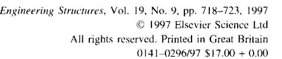

**PII: S0141-0296(96)00149-6** 

# **of structural damage in frequency: Detection through changes a review**

**O. S. Salawu** 

*ACECAD Sojhvare Ltd, BS-B7 Maidenhead Office Park, Westacott Way, Maidenhead, Berkshire SL6 3RT, UK* 

*(Received December 1994; revised version accepted June 1995)* 

The use of natural frequency as a diagnostic parameter in structural **assessment** procedures using vibration monitoring is discussed in the paper. The approach is based on the fact that natural frequencies are sensitive indicators of structural integrity. Thus, an analysis of periodical frequency measurements can be used to monitor structural condition. Since frequency measurements can be cheaply acquired, the approach could provide an inexpensive structural assessment technique. The relationships between frequency changes and structural damage are discussed. Various methods proposed for detecting damage using natural frequencies are reviewed. Factors which could limit successful application of vibration monitoring to damage detection and structural assessment are also discussed. © 1997 Elsevier Science Ltd.

**Keywords:** damage detection, dynamic testing, natural frequency, structural assessment, structural integrity, vibration monitoring

# **1. Introduction**

ELSEVIER

Existence of structural damage in an engineering system leads to modification of the vibration modes. These modifications are manifested as changes in the modal parameters (natural frequencies, mode shapes and modal damping values) which can be obtained from results of dynamic (vibration) testing. In the literature, the terms natural frequency, modal frequency and resonant frequency are often used. All three refer to the same item.

Changes in the modal parameters may not be the same for each mode since the changes depend on the nature, location and severity of the damage. This effect offers the possibility of using data from dynamic testing to detect, locate and quantify damage. Results of tests conducted at different times, possibly coinciding with principal or other scheduled inspections, offer the opportunity of monitoring changes in structural condition with time. One other advantage of measuring vibration responses is the global nature of the derived natural frequencies. This allows measurement points to be chosen to suit the test situation.

Modal parameters can be easily and cheaply obtained from measured vibration responses. The responses are acquired by some form of transducer which monitors the structural response to artificially induced excitation forces or ambient forces in the service environment. Low input energy levels are sufficient to produce measurable

responses since the input energy is dynamically amplified. in a few cases, the need for artificial excitation could make the test relatively expensive. Discussions on dynamic testing can be found elsewhere ~.

# **2. Effects of structural damage on natural frequency**

The presence of damage or deterioration in a structure causes changes in the natural frequencies of the structure. The most useful damage location methods (based on dynamic testing) are probably those using changes in resonant frequencies because frequency measurements can be quickly conducted and are often reliable. Abnormal loss of stiffness is inferred when measured natural frequencies are substantially lower than expected. Frequencies higher than expected are indicative of supports stiffer than expected 2 It would be necessary for a natural frequency to change by about 5% for damage to be detected with confidence 3. However, significant frequency changes alone do not automatically imply the existence of damage since frequency shifts (exceeding 5%) due to changes in ambient conditions have been measured 4 for both concrete and steel bridges within a single day.

At modal nodes (points of zero modal displacements), the stress is minimum for the particular mode of vibration. Hence, the minimal change in a particular modal frequency could mean that the defect may be close to the modal node. The other modal frequency variations can still be used to determine the magnitude of damage. Results of dynamic tests on 1/7 scale models of simply supported one- and two-cell box girder bridges show a decrease in the fundamental natural frequency with progressive damage 5. Near the ultimate load, the frequency decreased linearly by about 40% and 75% for the one-cell and two-cell bridges, respectively. Other results 6 14 of dynamic tests on model and fullscale structures indicate that changes in resonant frequencies can occur due to support failure, crack propagation, shear failure and overload causing internal damage.

From results ~5 of vibration tests on concrete portal frames, it was found that the degree of reduction in natural frequency is dependent on the position of the defect relative to the mode shape for a particular mode of vibration. Similar observations were reported ~6 from tests conducted on a 20 m high steel mast. Damage at regions of comparatively high stress in the frames (tests in Ref. 15) resulted in significant reduction (up to 15%) in the resonant frequencies. Increased accuracy of the diagnosis when cracks/damage occurred at sections of high stresses was also noticed by other researchers ~ 1.17,18. These findings suggest that detection of damage using frequency measurements might be unreliable when the damage is located at regions of low stresses. Thus, a shift in natural frequencies alone might not provide sufficient information for integrity monitoring, unless the damage is in an important load bearing member ~9. A theoretical explanation of the relationship between the magnitude of frequency changes and the extent of damage is given below.

The existence of a crack at a section of a beam is equivalent to a reduction (proportional to the crack's severity) in the second moment of area. This leads to a reduction in the local bending stiffness at that cross-section. The modified beam can be represented as two beams connected by a torsional spring (which models the section) with a stiffness dependent on the depth of the crack ~7. This torsional spring model was probably first proposed by Chondras and Dimarogonas 2°. A similar crack model based on the 'fracture hinge' concept has been subsequently proposed 2~'22. The consequence of reduced local bending stiffness is a lowering of the values of the natural frequencies in bending. The natural frequency changes vary proportionally with the square root of the stiffness change, thus underlining the need for relatively large stiffness changes before significant frequency changes can be detected. The reduction (in frequency) becomes more important when the crack is at regions of high curvature for the modes under consideration.

Results 23 of modal testing of two continuously supported plates indicate that except for the lower modes, the resonant frequency does not change much with the variation of the support stiffness. However, the trend in the changes depends upon the type (as characterized by stiffness) of test structure and supporting base. The results indicate that if the natural frequency of the supporting system is greater than that of the structure being tested, any increase of the stiffness of the connection between the two will increase the natural frequency measured. The reverse is true when the natural frequency of the support is less than that of the test structure.

Results from some experimentaP 5'24 and numerical 25 studies have suggested that the lower vibration modes would probably be best suited for damage detection. How-

ever, Begg *et al. 26* stated that modes higher than the first should be used in damage detection so as to improve the identification. The increased sensitivity of the higher modes to local damage has also been mentioned by others 27 32. Since these higher modes are usually unavailable from the results of a full-scale modal survey, their use in damage detection cannot be fully justified 33. A more appropriate approach is to use the modes most sensitive to the damage event. This approach has been discussed elsewhere 34 where a method for identifying damage sensitive vibration modes is also presented.

Camomilla *et al. 35* noted that the vibration frequencies of an analytical model of a prestressed concrete stay (of a cable-stayed bridge) were not particularly sensitive to the reduction in the stiffness of the prestressing reinforcement which simulated damage phenomena. This was thought to be due to the fact that, given the direct relationship between the area of concrete and that of steel, stiffness of the combined steel/concrete cross-section varied little as a result of the simulated damage. It has also been noted 36 that for a prestressed concrete structure, significant loss (50%) of prestressing force might not be detected by natural frequency changes if the two dynamic tests (in the initial state and after several years) are both performed when only dead loads are applied. This is because loss of prestressing force only reduces the load (P) at which excessive tension in concrete opens cracks and if the dynamic tests are conducted at lower loads (<P), no changes in dynamic parameters might be detected.

Further insight into the relationship between damage and changes in frequencies for prestressed structures has been given by Kato and Shimada 37 who monitored changes in the dynamic parameters during the failure process of a prestressed concrete bridge. A small change in vibrational characteristics occurred while the prestressing wires were in the elastic state even when cracking occurred. After the wires exceeded the elastic limit, sudden decrement of natural frequency was observed. This continued as the failure progressed. The observations offer a possibility of discovering weaknesses in the prestressing steel wires of a prestressed concrete bridge. However, tendon break as a result of local tendon corrosion, especially in post-tensioned structures, might not be detectable since the changes in global stiffness, which govern response to loading, will be very small 38.

# **3. Methods of damage detection and location using natural frequency changes**

Ju and Mimovich ~8,22 used changes in modal frequencies to locate damage occurring at sections of a beam to within 3% of the length. It was found that the accuracy of the damage localization was improved to less than 1% of the length when the built-in end of the experimental beam was represented by a torsional spring. A fundamental assumption, and limitation, of the method used is that the damage can be represented using the 'fracture hinge' concept 2j. Changes in modal frequencies were also used to locate damage in the investigations reported elsewhere 17,2°,39-43. The methods used in the investigations are not likely to be applicable to structures other than the simple cases (typically, a simple beam with artificially induced cuts) considered.

The method of Cawley and Adams ~ uses the sensitivity concept and is based on the premise that the ratio of frequency changes in two modes is a function of the location of the damage only, if changes in stiffness are independent of frequency. To locate the defect, theoretical frequency shifts, due to damage at selected positions on the structure, are calculated and compared with measured values. Erroneous results are obtained for defects involving creation or alteration of mode shapes and no indication is given as to the accuracy of the predicted damage site. Another drawback of the Cawley and Adams method, and indeed most sensitivity-based methods, is the use of considerable computing time subsequent to physical measurement as a consequence of the need to model all possible damage mechanisms at various possible sites. Application of the method to damage location in reinforced concrete and steel beams revealed that at least nine modes should be included in the computations if the damage is to be located with any reasonable accuracy 25. Other damage location methods using frequency changes and sensitivity analysis have been proposed 45-48. Accuracy of sensitivitybased methods is dependent on the quality of the finite element model (or other theoretical model) used to compute the sensitivities. The methods are most useful for skeletal structures where the damage event affects one significant stiffness component in the structure.

Law *et al. 49* have suggested a technique for determining structural stiffness changes and positions of defects from measured changes in resonant frequencies. The technique uses a finite-element model of the structure and assumes the structural mass matrix to be unsymmetrical so that a unique identification can be obtained. This assumption does not always hold. Solution of the identification problem involves utilization of a non-linear programming method which requires a weighting matrix and vectors defining upper and lower bounds for the identification factors. Selection of appropriate matrix and vectors would affect the results. It appears that the identification is improved if only certain parts of the structure are included in the formulation. Since prior knowledge of damaged areas is unavailable, determining which part to include might be difficult.

A global integrity index for detecting changes in the structural integrity of a given engineering system has recently been proposed 5°. The index is obtained from a linear combination of the damaged structure's frequencies to the undamaged structure's frequencies and is capable of detecting either a reduction or an increase in the global structural stiffness. Successful application of the method to the integrity assessment of full-scale bridges has been reported 5 ~.

Measurement of natural frequency can be used to estimate the tension in the stay cables of cable-stayed bridges 5~. Estimated values of the cable tension significantly lower than design or as-built values indicates loss of cable tension. A similar approach (though using a different formulation) was adopted to determine the stress levels in the prestressing cables of reinforced concrete stays of the Polcevera viaduct, Genoa, Italy 35. One main problem with this technique is the fact that deterioration of a rope or cable by corrosion or by breaking of wires will change the rope's cross-section and reduce its strength but may not alter rope tension 46. In such circumstances, the existence of damage may not be detected by natural frequencies; especially if axial modes are used.

Uzgider *et al. 53* have proposed a damage location method which uses measured natural frequencies to identify stiffhess parameters. Stiffness parameters and vibration modes which the parameters significantly influence are first selected. The natural frequencies of the selected modes are then used to identify the stiffness parameters. The relative magnitudes of the differences between the identified parameters and prior estimates are used to indicate the presence of structural damage. Success of the method depends on identification of suitable stiffness parameters, accurate definition of base values (prior estimates) of the parameters and values selected for the lower and upper limits of frequency and parameter value variation. The need for a very sophisticated mathematical model of the structure is another limitation of the method.

Zhang *et al. 54* proposed a pattern recognition method for detecting structural faults in frame structures. The same approach was also applied to the diagnosis of defects in foundation piles 55. The method is based on the fact that the ratio of the relative change in natural frequency between any two modes is equal to the ratio of the squares of the corresponding strain modal values at the fault. Due to experimental and analysis errors, the equality is only approximate. To account for this, two parameters were defined to control the fault identification. Thus, accuracy of the method is highly dependent on the choice of proper values for the control parameters. Furthermore, the method is only applicable to faults which can be represented as slots.

# **4. Factors to consider when using natural frequencies for damage detection in prototypes**

Some factors to consider when using vibration testing for integrity assessment are discussed in this section. For successful utilization of vibration data in assessing structural condition, measurements should be taken at points where all the modes (in the frequency range of interest) are well represented. The simplest way of achieving this is to conduct a theoretical vibration analysis of the structure prior to testing. The best positions would be those points where the sum of the magnitudes of the mode shape vectors are maximized. A few simple procedures that may be applicable to test planning can be found in Bolton 56. Development of an expert system for vibration test planning has also been reported 57.

For effective utilization of dynamic testing as a diagnostic tool, it is necessary to understand the effects of deterioration and defects on the dynamic characteristics of structural systems. For example, long span bridges are not likely to show measurable changes in dynamic properties if local damage is sustained 25. In addition, dynamic characteristics are sensitive to changes in support conditions that may have little structural consequence. Responses measured at boundaries (abutment, piers and other support types) could also yield erroneous results 58. It is also important that the effects of environmental factors, such as temperature and humidity, on changes in dynamic characteristics be either small or predictable 59. Identification of a 'sufficient' number of frequency variations may be necessary before defects can be adequately located. For safety inspection of long span suspension bridges, detection of natural frequency changes in the order of 0.01 Hz may be required 6°.

Quantitative relationships between changes in dynamic parameters and environmental factors are very rare. The many variables involved will make assigning numerical factors difficult. This probably explains why most of the methods reviewed do not explicitly account for environmental factors. It is more convenient to define threshold values (for the dynamic parameters) beyond which existence of damage can be inferred. An investigation into this issue has been reported by Askegaard and Mossing s9 who showed that the relative change in the magnitude of a welldefined natural frequency of an undamaged structure is little influenced by changes in temperature, humidity, etc. if measurements to be compared are made at the same time of the year. Their results showed that changes in natural frequencies during short-term tests were insignificant while the fluctuations observed over a two-year period were much less than those occurring in deteriorated structures. Further discussions of the effects of temperature on the resonant frequencies of structures can be found in Adams and Coppendale 6~. The fluctuations in damping values are much larger and are discussed in a separate paper 62.

From an analysis of the effect of ambient conditions on the dynamic response of four prestressed concrete bridge decks, Purkiss *et al. 63"64* concluded that the most significant variable affecting measured responses is the soffit temperature of the bridge deck. The other variables investigated were the site's air temperature and humidity; mean air pressure; and mean rainfall on the day preceding the test. The results show a gradual decrease in natural frequency with increasing soffit temperature. The variation in temperature was not related to time. The relationships observed would not undermine using vibration data for assessment as long as measurements are taken at similar periods and ambient conditions are similar.

Other factors to consider are the consistency and reliability of the testing procedures. Previous investigations have paid little attention to the random effect of environment and test equipment on test results. Furthermore, the sensitivity of a dynamic monitoring system is limited, at least, by the observed random variation due to environmental influence and instrumentation accuracy. Other researchers 4,9'27'65 have also mentioned these factors. To account for these limitations, it would be necessary to develop criteria based on statistical concepts to establish windows for triggering warnings. Use of trigger windows would be synonymous with the concept of mechanical signature analysis employed in the mechanical and nuclear industries for assessing integrity of machinery and products.

A limitation of structural assessment using vibration testing is the need to conduct at least two series of tests - one on the pristine structure and another after a period of time. In most cases, the (measured) natural frequencies of the as-built structure are unavailable and assessment engineers require information on the current state of the structure. To circumvent this limitation, two methods for assessing the integrity of prestressed bridges using results from one series of tests have been suggested 36. In principle, the methods should be applicable to any type of bridge. At least two or three tests would be necessary to determine the frequency and damping ratio of the first mode. The first test is on the structure without any load while the others are after adding different levels of uniformly distributed imposed loads. The main disadvantage of the technique is the requirement to apply large imposed loads especially for large structures where the practicability and cost could be prohibitive.

# 5. Conclusions

A review of methods of damage detection using natural frequencies has shown that the approach is potentially useful for routine integrity assessment of structures. Frequency values obtained from periodic vibration testing can be used to monitor structural behaviour and also assess structural condition. An advantage of the approach is the global nature of the identified frequencies; thus allowing the measurement points to be customized.

However, many of the proposed methods require either a theoretical model of damage or a set of sensitivity values to be computed before physical measurements. Perturbation/sensitivity analysis methods might be very slow if matrices are large especially if a complete eigensolution is required for each iteration. To be truly realistic, the methods would require consideration of all possible damage events at various locations on the structure. Consequently, the computations that would be required for large civil engineering structures could be prohibitive. These methods are thus limited in application to specific structural geometries and the type of damage model assumed. In addition, utilization of a theoretical damage model could introduce uncertainties into the results. Methods that rely only on measured data without any prior theoretical assumptions would be more appropriate to large civil engineering structures.

Natural frequency changes alone may not be sufficient for a unique identification of the location of structural damage. This is because cracks associated with similar crack lengths but at two different locations may cause the same amount of frequency change. Other factors to consider are the effect of ambient conditions on the dynamic response of the structure and the consistency and reliability of the testing procedures. Integrity assessment of civil engineering structures using vibration data would require a method which uses only test data from the first few modes and is based on simple assumptions about the behaviour of the structure.

# **References**

- 1. Salawu, O. S. and Williams, C. 'A review of full-scale dynamic testing of bridge structures', *Engineering Structures,* 17 (2), 113- 121 (1995)
- 2. Morgan, B. J. and Oesterle, R. G. 'On-site modal analysis a new powerful inspection technique' in *Proceedings of the 2nd International Bridge Conference,* Pittsburg, Pennysylvania, pp 108- 114, 1994
- 3. Creed, S. G. 'Assessment of large engineering structures using data collected during in-service loading' in *Structural Assessment* (edited by F. K. Garas, J. L. Clarke and G. S. T. Armer), Butterworths, London, pp 55-62
- 4. Aktan, A. E., Lee, K. L., Chuntavan, C. and Aksel, T. 'Modal testing for structural identification and condition assessment of constructed facilities' in *Proceedings, 12th International Modal Analysis Conference,* Honolulu, Hawaii, 1, pp 462-468, 1994
- 5. Mirza, M. S., Ferdjani, O., Hadj-Arab, A., Joucdar, K., Khaled, A. and Razaqpur, A. G. 'An experimental study of static and dynamic responses of prestressed concrete box girder bridges', *Canadian Journal of Civil Engineering,* 17 (3), 481-493 (1990)
- 6. /~g~rdh, L. 'Modal analyses of two concrete bridges', *Structural Engineering International,* 1 (4), 35-39 (1991)
- 7. Haroun, M. A., Mourad, S. A. and Flynn, N. H. 'Modal characteristics of reinforced concrete pier walls before and after cyclic testing' in *Proceedings, 1 lth International Modal Analysis Conference,* Kissimmee, Florida, 2, pp 1299-1302, 1993
- 8. Kawahito, T. 'A study on the inspection method of soundness of expressway bridges by vibration characteristics - Part I' (in Japanese), *Report of the Laboratory of Nihon Doro Kodan,*  pp 158-167
- 9. Kroggel, O. 'Nondestructive testing of the integrity of bridges: an EC project' in *Bridge Management Vol. 2* (edited J. E. Harding, G. A. R. Parke and M. J. Ryall) Thomas Telford, London, pp 727- 737, 1993

- 10. Mazurek, D. F. and DeWolL J. T. Experimental study of bridge monitoring technique, *Journal of Structural Engineering, ASCE,* | 16 (9), 2532-2549 (1990)
- 11. Salane, H. J. and Baldwin, J. W. Identification of modal properties of bridges, *Journal of Structural Engineering, ASCE.* 116 (7), 2008- 2021 (1990)
- 12. Salane, H. J., Baldwin, J. W. and Duffield, R. C. Dynamics approach for monitoring bridge deterioration, *Transportation Research Record,* 832, pp 21-28, 1987
- 13. Savage, R, J. and Hewlett, P. C. 'A new NDT method for structural integrity assessment, *NDT International,* 11, pp 61-66 (1978)
- 14. Sun, X. and Hardy, H. R. 'An investigation on applicability of modal analysis as nondestructive evaluation method in geotechnical engineering' in *Proceedings, lOth International Modal Analysis Col!ference,* San Diego, California, 1, pp 9-19, 1992
- 15. Moradalizadeh, M. Evaluation of crack defects in frames structures using resonant frequency techniques, M. Phil. thesis, Civil Engineering Department, University of Newcastle Upon Tyne, Newcastle, 1990
- 16. Rytter, A. and Kirkegaard, P. H. 'Vibrational-based inspection of a steel mast' in *Praceedings, 12th International Modal Analysis Con- .[~'renee,* Honolulu, Hawaii, 2, pp 1602-1608, 1994
- 17. Gomes, A. J. M. A. and Silva, J. M. M. E. "On the use of modal analysis for crack identification" in *Proeeedings, 8th International Modal Analysis Conference,* Florida, 2, pp 1108-1115, 1990
- 18. Ju, F. D. and Mimovich, M. 'Modal frequency method in diagnosis of fracture damage in structures' in *Proceedings, 4th International Modal Analysis Conference,* Los Angeles, 2, pp 1168 1174, 1986
- 19. ldicbandy, V. G. and Ganapathy, C. 'Modal parameters for structural integrity of fixed offshore platforms', *Experimental Mechanics,* 30 (4), 382-391 (1990)
- 20. Chondras, T. G. and Dimarogonas, A. D. 'Identification of cracks in welded joints of complex structures', *Journal of Sound and Vibration,* 69 (4), 531-538 (1980)
- 21. Ju, F. D., Akgtin, M., Paez, T. L. and Wong, E. T. 'Modal method in diagnosis of fracture damage in simple structures', *Productive Application of Meehanieal Vibrations,* Applied Mechanics Division. ASME, 52, 113-126 (1982)
- 22. Ju, F. D. and Mimovich, M. 'Experimental diagnosis of fracture damage in structures by the modal frequency method' in *Modal Testing and Analysis* (edited T. G. Came and J. C. Simonis) pp 29 36 ASME, 1987
- 23. Chowdhury, M. R. 'Experimental modal testing and analysis of continuously supported structures' in *Proceedings, 8th International Modal Analysis Conference,* Florida, 1, pp 109-114, 1990
- 24. Sl~.stan, J. and Pietrzko, S. "Changes of RC-beam modal parameters due to cracks' in *Proceedings, llth hzternational Modal Analysis Conference,* Kissimmee, Florida, 1, pp 70-76, 1993
- 25. Brownjohm J. M. W. 'Assessment of structural integrity by dynamic measurements', Ph.D Thesis, Department of Civil Engineering, University of Bristol, Bristol, 1988
- 26. Begg, R. D., Mackenzie, A. C., Dodds, C. J. and Loland, O. 'Structural integrity monitoring using digital processing of vibration signals' in *Proceedings, 8th Of J~'hore Technology Cot!l~,renee,* Houston, Texas, 2, 1994
- 27. Alampalli, S., Fu, G. and Abdul Aziz, 1. "Modal analysis as a bridge inspection tool' in *Proceedings, lOth International Modal Analysis Conference,* San Diego, California, 2, pp 1359-1366, 1992
- 28. Biswas, M., Pandey, A. K. and Samman, M. M. 'Diagnostic experimental spectral/modal analysis of a highway bridge', *The h2ternational Journal of Analytical and Experimental Modal Analysis, 5*  (1), 33-42 (1990)
- 29. Cempel, C., Natkc, H. G. and Zi61kowski, A. 'Application of transformed normal modes for damage location in structures' in *Strnc tural lntegri O, Assessment,* pp 246-255, Elsevier Applied Science, London, 1992
- 30. Flesch, R. G., Gerasch, W. J. and Kernbichler, K. 'The significance of system identification for diagnostic dynamic testing of bridges' in *Structural Dynamics, Proceedings of the European Conference on Struetural Dynamics Eurodyn 90,* Bochum, Germany, A. A. Balkema, Rotterdam/Brookfield, 1, pp 419-426, 1991
- 31. Lieven, N. A. J. and Waters, T. P. 'Error location using normalised orthogonality' in *Proceedings, 12th International Modal Analysis Conference,* Honolulu, Hawaii, l, pp 761-764, 1994
- 32. Mannan, M. A. and Richardson, M. H. 'Detection and location of structural cracks using FRF measurements' in *Proceedings, 8th International Modal Analysis Conference,* Florida, 1, pp 652-657, 1990
- 33. Salawu, O. S. and Williams, C. 'Structural damage detection using

- experimental modal analysis a comparison of some methods' in *Proceedings, l lth International Modal Analysis Conference,* Kissimmee, Florida, 1, pp 254 260, 1993
- 34. Sa[awu, O. S. 'Identification o1" damage-sensitive vibration modes' in *Vibration and Noise '95, Proceedings of the International Conference on Vibration and Noise,* Venice, Italy, April 25-27 1995
- 35. Camomilla, G., Donferri, M., Santori, A. G. and Materazzi. L. 'Reflectometric and dynamic measurements on the stays of the Polcevera viaduct in Genoa (Italy)' in *Bridge Management 2* (edited J.E. Harding, G. A. R. Parke and M. J. Ryall), Thomas Telford, London, ppll8 127, 1993
- 36. AIocco, V., Buccino, F. Vitiello, E. and Fava, A. ~Evaluation of structural safety margins for existing post-tensioned concrete bridges via dynamic tests' in *Proeeedings. 5th International Coq[~renee on Structural Faults and Repair,* University of Edinburgh, Edinburgh, 1, pp263 271, 1993
- 37. Kato, M. and Shimada, S. 'Vibration of PC bridge during failure process, *Journal of Structural Engineering, ASCE,* 112 (7), 1692- 1703, 1986
- 38. Price. W. I. J. and Aguila, L. A. 'Assessment of deteriorating prestressed concrete bridges' in *Assessment q/ Rein~reed and Pre stressed Concrete Bridges,* The Institution of Structural Engineers, London, pp21-26, 1988
- 39. Adams. R. D., Cawley, P., Pye, C. J. and Stone. B. J. "A vibration technique for non-destructively assessing the integrity of structures', *Journal of Meehanieal Engineering Science,* **20** (2), 93-100 (1978)
- 40. A1-Ansary, M. D. and Azayem, K. M. 'A modal model for fatigue crack non-destructive testing' in *Proceedings, 4th International Modal Analysis Conference,* Los Angeles, !, 2l)2, 1986
- 41. Gudmundson, P. "Eigenfrequency changes of structures due to cracks, notches or other geometrical changes', *Journal of Mech. Phys. Solids,* 30 (5), 339-353 (1982)
- 42. Gudmundson, P. 'Changes in modal parameters resulting from small cracks" in *Proceedings, 2nd International Modal Analysis Col![i,rence,* 2, pp 690-697, 1984
- 43. Springer, W. T., Lawrence. K. L. and Lawley, T. J. 'Damage asscssment based on the structural frequency response function', *Experimental Mechanics,* 28 (1), pp 34-37 (1988)
- 44. Cawley, P. and Adams, R. D. 'The location of defects in structures from measurements of natural frequencies', *Journal of Strain Analysis,* 4 (2), 49 57 (1979)
- 45. Eggers, D. W. and Stubbs, N. 'Structural assessment using modal analysis techniques' in *Proceedings, 12th International Modal Analysis Conferenee,* Honolulu, Hawaii, 2, pp 1595 I60l, 1994
- 46. Heam, G. and Testa, R. B. 'Modal analysis for damage detection in structures', *Journal or" Structural Engineering. ASCE,* 117 (10), pp 3042 3063. I991
- 47. Meneghetti. U. and Maggiore, A. 'Crack detection by sensitivity analysis' in *Proceedings. 12th International Modal Analysis Conl~r*ence, Honolulu, Hawaii, 2, pp 1292-1298, 1994
- 48. Penny, J. E. T., Wilson, D. A. L. and Friswell, M. 1. "Damage detection in structures using vibration data" in *Proceedings, llth htternational Modal Analysis Co~z~'rence,* Kissimmee, Florida. 2, pp861 867, 1993
- 49. Law, S. S., Xun, L. and Ward, H. S. "A vibration technique for structural stiffness identification" in *Proceedings, International Con- .f~,renee on Vibration Problems in Engineering,* Wuhan-Chungqing, 1, pp698-683. 1990
- 50. Salawu, O. S. 'An integrity index method for structural assessment of engineering structures using modal testing', *Insight: the Journal qf the British Institute of Non-Destruetive Testing,* 39 (1), 1997
- 51. Salawu. O. S. 'Non-destructive assessment of structures using the integrity index method applied to a concrete higl4way bridge'. *Insight: the Journal of the British Institute q['Non-Destructite Testing.* 37 (1). 875-878 (1995)
- 52. Gardner-Morse, M. G. and Huston, D. R. Modal identification of cable stayed pedestrian bridge, *Journal qf Structural Engineering, ASCE,* 119 ( 11 ), 3384-3404 (1993)
- 53. Uzgider, Z., Sanli, A. K., Piroglu, F. and Caglayan, D. B. 'Identification of railway bridges using locomotive-induced vibrations' in *Bridge Management 2* (edited J. E. Harding, G. A. R. Parke and M. J. Ryall), Thomas Telford, London, pp 833-841, 1993
- 54. Zhang, K. Y.. Gu, A. J. and Li, J. W. "Diagnosis of a slot fault on a frame structure' in *Proceedings, lOth htternational Modal Analysis" Conference,* San Diego, California, I, pp 549-553, 1992
- 55. Zhang, K. Y., Cheng, L. J. and Jin, T. X. 'Research on the diagnosis of defect on a building foundations pile' in *Proceedings, Ilth hzternational Modal Analysis Conferenee,* Kissimmee, Florida. 1, pp 690-695, 1993

- 56. Bolton, A. *Structural Dynamics in Practice,* 1st edn., McGraw-Hill International, London, 1994
- 57. Schtitze, M., Doll, H. and Hildebrandt, P. 'Review on an expert system under development - "Measurement techniques in civil engineering" - including structural assessment' in *Proceedings, 12th International Modal Analysis Conference,* Honolulu, Hawaii, 2, pp 1349-1355, 1994
- 58. Zhang, Z. 'Error study of bridge tests for the purpose of structural identification' in *Proceedings, 12th International Modal Analysis Conference,* Honolulu, Hawaii, 1, pp 433-441, 1994
- 59. Askegaard, V. and Mossing, P. 'Long-term observation of RC-bridge using changes in natural frequencies', *Nordic Concrete Research, 7,*  pp 20-27, 1988
- 60. Tang, J. P. and Leu, K. M. 'Vibration tests and damage detection of P/C bridges' in *ICOSSAR '89, Proceedings of the 5th International Conference on Structural Safety and Reliability,* ASCE, pp 2263- 2266, 1989

- 61. Adams, R. D. and Coppendale, J. 'Measurement of the elastic moduli of structural adhesive by a resonant bar technique', *Journal of Mechanical Engineering Science,* 18 (3), pp 149-159 (1976)
- 62. Salawu, O. S, 'Modal damping as a damage indication parameter'. (submitted for publication)
- 63. Purkiss, J. A., Bailey, M., Friswell, M. I., Penny, J. E. T. and Wood, M. G. 'The dynamic response of prestressed concrete bridge decks', Institution of Structural Engineers Library, London, 1994
- 64. Purkiss, J. A., Bailey, M., Friswell, M. I., Penny, J. E. T. and Wood, M. G. 'Analysis of the effect of ambient conditions on the dynamic response of prestressed concrete bridge decks', Institution of Structural Engineers Library, London, 1994
- 65. Fox, C. H. J. 'The location of defects in structures: a comparison of the use of natural frequency and mode shape data' in *Proceedings, lOth International Modal Analysis Conference,* San Diego, California, 1, pp 522-528, 1992